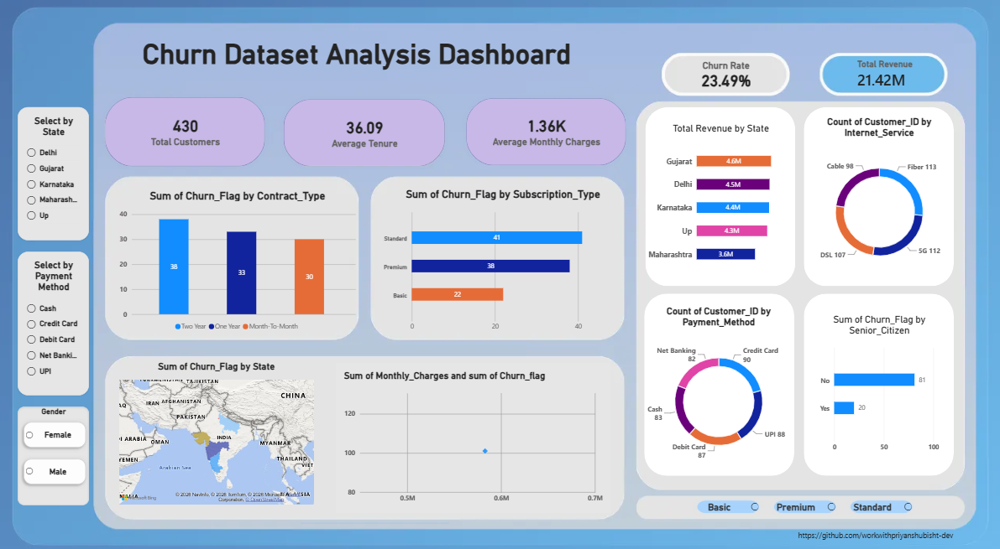

# 📉 Customer Churn Analysis: End-to-End (Python · MySQL · Power BI)

> An end-to-end data analytics project that takes a **messy customer dataset**, cleans it with Python, stores and queries it in **MySQL**, and presents the results in an **interactive Power BI dashboard** to show *who is churning, where, and what the business should look at next*.


---

## 📌 Table of Contents
1. [Business Problem](#-business-problem)
2. [Project at a Glance](#-project-at-a-glance)
3. [Project Workflow](#-project-workflow)
4. [Data Cleaning](#-data-cleaning)
5. [SQL Analysis](#-sql-analysis)
6. [Dashboard Preview](#-dashboard-preview)
7. [Key Insights](#-key-insights)
8. [Recommendations](#-recommendations)
9. [Limitations](#-limitations)
10. [Tech Stack](#-tech-stack)
11. [Repository Structure](#-repository-structure)
12. [How to Run](#-how-to-run)
13. [Author](#-author)

---

## 🎯 Business Problem

Customer churn directly hits recurring revenue, and keeping a customer is usually cheaper than winning a new one. This project answers:

- **How many** customers are churning?
- **Which segments** (contract, plan, payment method, internet service, state, tenure) churn the most?
- **Where does revenue come from**, and where is it at risk?
- **What should the business investigate or act on** to reduce churn?

---

## 📊 Project at a Glance

| Metric | Value |
|---|---|
| **Raw dataset** | `Churn_Unclean_Project.xlsx`: **542 rows × 18 columns** |
| **Cleaned dataset** | `cleaned_churn_data.csv`: **492 rows × 23 columns** (5 engineered features) |
| **Dashboard base** | **430 customers** (complete records only) |
| **Churn rate** | **23.49%** (101 of 430 customers) |
| **Total revenue** | **21.42M** |
| **Avg. tenure** | **36.09 months** |
| **Avg. monthly charges** | **1.36K** |
| **Geography** | 5 states, 10 cities in India |
| **Target variable** | `Churn` (Yes / No) |

### 🧮 How the rows moved through the pipeline

| Stage | Rows | What happened |
|---|---|---|
| Raw file | **542** | Original unclean data |
| After removing duplicates | **535** | 7 duplicate rows dropped |
| After validity filters | **492** | Invalid ages and negative charges removed |
| Dashboard / KPIs | **430** | Only records with no missing values are analysed |

### 🗂️ Column Dictionary

| # | Column | Description |
|---|---|---|
| 1 | `Customer_ID` | Unique customer identifier |
| 2 | `Customer_Name` | Customer name |
| 3 | `Gender` | Male / Female |
| 4 | `Age` | Customer age |
| 5 | `State` | State of residence |
| 6 | `City` | City of residence |
| 7 | `Tenure_Months` | Months subscribed |
| 8 | `Subscription_Type` | Basic / Standard / Premium |
| 9 | `Monthly_Charges` | Monthly bill amount |
| 10 | `Total_Charges` | Lifetime billed amount |
| 11 | `Contract_Type` | Month-to-Month / One Year / Two Year |
| 12 | `Payment_Method` | UPI / Cash / Debit Card / Credit Card / Net Banking |
| 13 | `Internet_Service` | Fiber / Cable / DSL / 5G |
| 14 | `Tech_Support` | Yes / No |
| 15 | `Senior_Citizen` | Yes / No |
| 16 | `Dependents` | Yes / No |
| 17 | `Churn` | **Target:** whether the customer left |
| 18 | `Last_Interaction_Date` | Date of last interaction |
| 19 | `Customer_Value` | *Engineered:* Monthly Charges × Tenure |
| 20 | `Monthly_Revenue` | *Engineered:* Monthly revenue per customer |
| 21 | `Tenure_Group` | *Engineered:* Bronze (0–12), Silver (13–24), Gold (25–48), Diamond (49–72) months |
| 22 | `Senior_Flag` | *Engineered:* Senior (age 60+) / Adult |
| 23 | `Churn_Flag` | *Engineered:* 1 = churned, 0 = retained |

---

## 🔄 Project Workflow

```
Raw Excel (542 × 18) ──► Python cleaning & feature engineering ──► MySQL database ──► SQL analysis ──► Power BI dashboard ──► Insights
```

---

## 🧹 Data Cleaning

Done in Python (`analysis_python.ipynb`). The raw file had the problems analysts see on real projects:

| Issue Found | Treatment |
|---|---|
| **7 duplicate rows** | Removed with `drop_duplicates()` |
| **Placeholder values** (`N/A`, `NULL`, blanks) | Converted to proper nulls |
| **Extra spaces** (`' male '`, `'Premium  '`) | Trimmed whitespace across all text columns |
| **Inconsistent casing** (`BASIC`, `basic`, `YES`, `yes`) | Standardised to proper case |
| **Invalid ages** (values from 3 to 165) | Kept only ages 18–100 |
| **Negative charges** (`Monthly_Charges`, `Total_Charges`) | Removed rows with negative values |
| **Dates stored as text** | Converted to datetime |
| **Numeric columns read as text** | Converted with `pd.to_numeric` |

**Feature engineering:** `Customer_Value`, `Monthly_Revenue`, `Tenure_Group`, `Senior_Flag`, `Churn_Flag`.

📁 **Output:** `cleaned_churn_data.csv`, also loaded into MySQL as the `cleaned_churn_data` table via SQLAlchemy.

---

## 🗄️ SQL Analysis

Queries in `churn_analysis_in_sql.sql` (MySQL) cover:

- Total customers, total churned customers, **churn rate**
- Average monthly charges and average tenure
- Customers by contract type, internet service, payment method and subscription type
- Churned customers by state and by senior-citizen status
- Revenue by state
- Average charges by contract type
- Top 10 high-value customers
- Customers without tech support

---

## 📈 Dashboard Preview



**Interactive Power BI dashboard** (`churn_analysis_dashboard.pbix`) featuring:
- **KPI cards:** total customers, average tenure, average monthly charges, churn rate, total revenue
- Churn by **contract type** and **subscription type**
- Customers by **internet service** and **payment method**
- **Revenue by state** and a churn map by state
- Churn by **senior citizen** status
- **Slicers** for state, payment method, gender and subscription type

---

## 💡 Key Insights

*Based on the 430 complete customer records shown in the dashboard.*

| # | Insight | Finding |
|---|---|---|
| 1 | **Overall churn** | **23.49%** of customers churned (101 of 430) |
| 2 | **Contract type** | **Two Year contracts churn the most (29.0%)**, followed by One Year (22.9%) and Month-to-Month (19.4%) |
| 3 | **Subscription plan** | **Standard (27.2%)** and **Premium (25.9%)** churn far more than **Basic (16.7%)** |
| 4 | **Tenure** | Churn peaks in the **13–48 month** range (about 28%) and drops to **15.6%** for customers with 49+ months |
| 5 | **Payment method** | **UPI (28.4%)** and **Debit Card (27.6%)** churn most; **Cash (15.7%)** least |
| 6 | **Internet service** | **Cable (28.6%)** has the highest churn; **DSL (16.8%)** the lowest |
| 7 | **Region** | **Uttar Pradesh** has the highest churn rate (27.9%); **Maharashtra** the lowest (15.5%) |
| 8 | **Revenue** | Gujarat (4.6M) and Delhi (4.5M) lead revenue; Maharashtra is lowest (3.6M) |
| 9 | **Senior citizens** | 20 of the 101 churned customers are seniors; the rate (25.3%) is close to non-seniors (23.1%) |

> 🔎 **Interesting finding:** the common assumption is that month-to-month customers leave most. In this dataset the opposite holds: **longer contracts show higher churn**, which is worth investigating further.

---

## ✅ Recommendations

1. **Investigate long-contract churn.** Two Year contracts churn most, so check whether pricing, service quality or renewal handling is the cause.
2. **Target the 13–48 month window** with loyalty offers or check-ins, since this is where churn peaks.
3. **Review Standard and Premium plans.** They churn much more than Basic, so check whether their price matches the value customers see.
4. **Look at Cable service quality** and at **UPI / Debit Card** payment friction (failed payments, auto-pay setup).
5. **Run a retention pilot in Uttar Pradesh**, the highest-churn state, and learn from Maharashtra, the lowest.

---

## ⚠️ Limitations

- Dashboard figures use **430 complete records**; 62 cleaned records with missing fields are excluded.
- With a sample this small, segment differences of a few percentage points may be noise rather than real patterns.
- Tech support showed **no meaningful effect** on churn (23.7% without vs 23.3% with), so it is not used as a recommendation.
- This is descriptive analysis; no predictive model has been built yet.

---

## 🛠️ Tech Stack

| Category | Tools |
|---|---|
| **Data Cleaning & Feature Engineering** | Python, Pandas, NumPy, Jupyter Notebook |
| **Database & Querying** | MySQL, SQL, SQLAlchemy, PyMySQL |
| **Visualization** | Power BI |
| **Raw Data** | Microsoft Excel |

---

## 📁 Repository Structure

```
churn-analysis/
│
├── Churn_Unclean_Project.xlsx      # Raw dataset (542 rows × 18 columns)
├── analysis_python.ipynb           # Python cleaning + feature engineering
├── cleaned_churn_data.csv          # Cleaned dataset (492 rows × 23 columns)
├── churn_analysis_in_sql.sql       # MySQL queries
├── churn_analysis_dashboard.pbix   # Power BI dashboard
├── dashboard_ss.png                # Dashboard screenshot
└── README.md                       # Project documentation
```

---

## ▶️ How to Run

1. **Clone the repository**
   ```bash
   git clone https://github.com/workwithpriyanshubisht-dev/churn-analysis.git
   cd churn-analysis
   ```
2. **Install Python dependencies**
   ```bash
   pip install pandas numpy sqlalchemy pymysql openpyxl jupyter
   ```
3. **Run the notebook**: open `analysis_python.ipynb` to clean the raw data and export the cleaned file.
   ```bash
   jupyter notebook analysis_python.ipynb
   ```
4. **Run the SQL**: load the cleaned data into MySQL (the notebook's last cell does this with your own credentials), then run `churn_analysis_in_sql.sql`.
5. **View the dashboard**: open `churn_analysis_dashboard.pbix` in **Power BI Desktop**.

---

## 🧠 Skills Demonstrated

`Data Cleaning` · `Feature Engineering` · `SQL (MySQL)` · `Python (Pandas)` · `Data Visualization` · `Dashboard Design` · `Business Insight Generation`

---

## 👤 Author

**Priyanshu Bisht**
BCA Graduate, IMS Noida (2026)

📧 Email: `workwithpriyanshubisht@gmail.com`
🔗 LinkedIn: `https://www.linkedin.com/in/priyanshu-bisht-17418b412`
💻 GitHub: `https://github.com/workwithpriyanshubisht-dev`

---

⭐ *If you found this project useful, consider giving it a star!*
